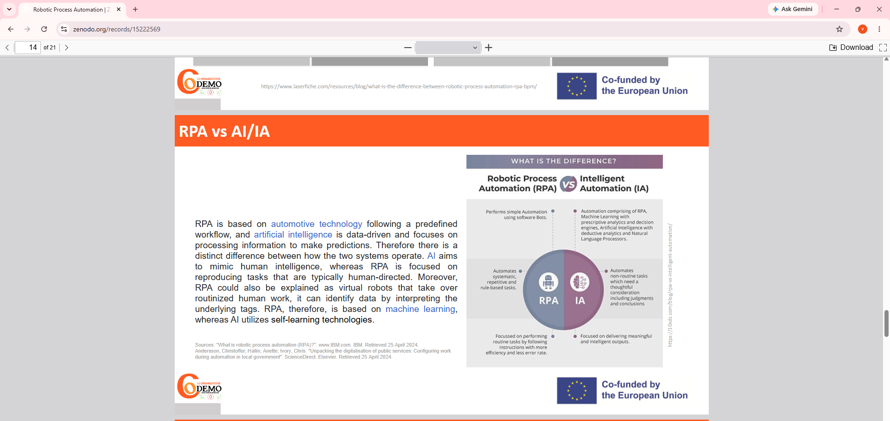
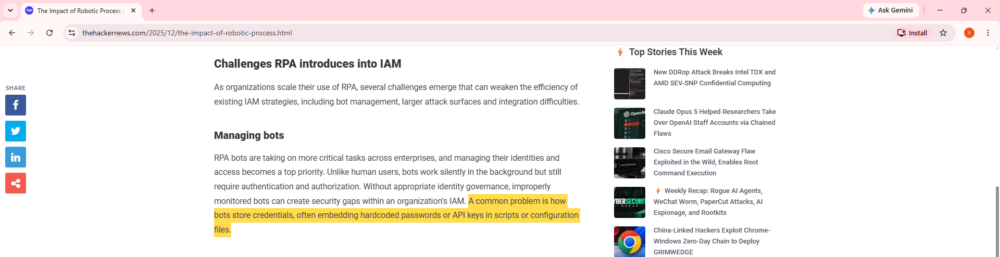

# Week 10: E-Portfolio 3: Robotic Process Automation and Process Cybersecurity

## Artefact 1: Robotic Process Automation (university lesson)
Zenodo record · DOI: [10.5281/zenodo.15222569](https://doi.org/10.5281/zenodo.15222569)

**Summary:**

Siderska (2025) is a university lesson that teaches students to build basic software robots in UiPath Studio. It defines RPA as software robots that copy human actions in digital systems (Siderska 2025, p. ?). It lists the tasks with the highest potential for robots, such as moving data between systems and reading PDFs and emails (Siderska 2025, p. ?).

**Why I chose it:**

I selected this because I needed to know what RPA is before I could judge its risks. The lesson made one difference clear. RPA follows fixed rules, while AI learns from data (Siderska 2025, p. ?). Before this I used the two words as if they meant the same thing. Now I understand that a bot copies a process exactly, flaws included. This is where Portfolio 2 ended: a process nobody understands should not be automated (Sinur, Misiak & Biernatowski 2025, p. 18). It is teaching material rather than research, so I used it for definitions only.

*Figure 1: The lesson's comparison of RPA and AI, which I highlighted while reading. Source: Siderska (2025, p. ?)*

---

## Artefact 2: The Impact of RPA on Identity and Access Management (online article)
The Hacker News: [read the article](https://thehackernews.com/2025/12/the-impact-of-robotic-process.html)

**Summary:**

The Hacker News (2025, 'What is Robotic Process Automation (RPA)?') explains that RPA bots act as non-human identities and need the same governance as human users. It names three challenges: managing bots, a bigger attack surface, and gaps between bots and older identity systems (The Hacker News 2025, 'Challenges RPA introduces into IAM'). A common problem is bots with passwords hardcoded in their scripts (The Hacker News 2025, 'Managing bots').

**Why I chose it:**

This article is here because it changed how I see a bot. Before this I thought of a bot as a tool. Now I see it as a user that needs managing from creation to removal. An invoice bot with its finance-system password saved inside its script is exactly the problem described. If it also had too much access, an attacker could use it to move through the network (The Hacker News 2025, 'Increased attack surface'). I read it carefully, because it is a contributed piece from a company promoting its own password software. I used it for the risks, not the product advice.

*Figure 2: The article's section on managing bots, with the sentence on hardcoded passwords highlighted. Source: The Hacker News (2025, 'Managing bots')*
