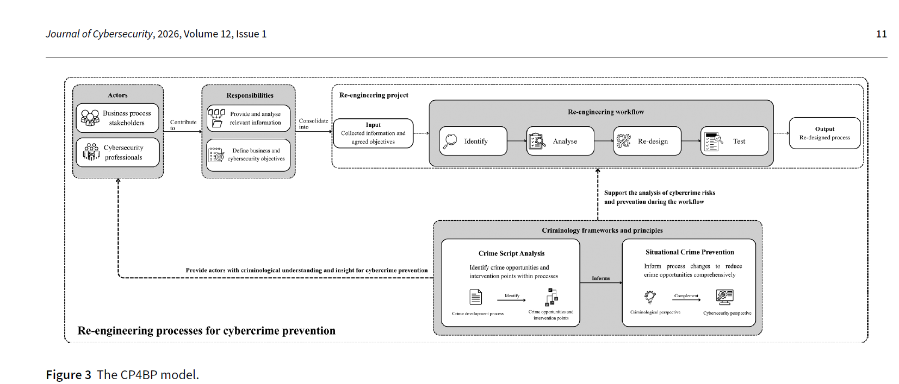
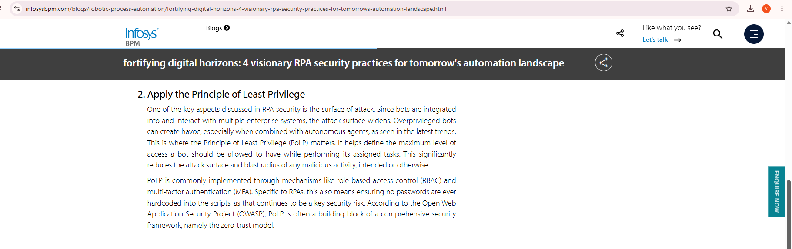

# Week 10: E-Portfolio 3: Robotic Process Automation and Process Cybersecurity

## Artefact 1: Robotic Process Automation (university lesson)
Zenodo record · DOI: [10.5281/zenodo.15222569](https://doi.org/10.5281/zenodo.15222569)

**Summary:**

Siderska (2025) is a university lesson that teaches students to build basic software robots in UiPath Studio. It defines RPA as software robots that copy human actions in digital systems (Siderska 2025, p. ?). It lists the tasks with the highest potential for robots, such as moving data between systems and reading PDFs and emails (Siderska 2025, p. ?).

**Why I chose it:**

I selected this because I needed to know what RPA is before I could judge its risks. The lesson made one difference clear. RPA follows fixed rules, while AI learns from data (Siderska 2025, p. ?). Before this I used the two words as if they meant the same thing. Now I understand that a bot copies a process exactly, flaws included. This is where Portfolio 2 ended: a process nobody understands should not be automated (Sinur, Misiak & Biernatowski 2025, p. 18). It is teaching material rather than research, so I used it for definitions only.

*Figure 1: The lesson's comparison of RPA and AI, which I highlighted while reading. Source: Siderska (2025, p. ?)*

---

## Artefact 2: The Impact of RPA on Identity and Access Management (online article)
The Hacker News: [read the article](https://thehackernews.com/2025/12/the-impact-of-robotic-process.html)

**Summary:**

The Hacker News (2025, 'What is Robotic Process Automation (RPA)?') explains that RPA bots act as non-human identities and need the same governance as human users. It names three challenges: managing bots, a bigger attack surface, and gaps between bots and older identity systems (The Hacker News 2025, 'Challenges RPA introduces into IAM'). A common problem is bots with passwords hardcoded in their scripts (The Hacker News 2025, 'Managing bots').

**Why I chose it:**

This article is here because it changed how I see a bot. Before this I thought of a bot as a tool. Now I see it as a user that needs managing from creation to removal. An invoice bot with its finance-system password saved inside its script is exactly the problem described. If it also had too much access, an attacker could use it to move through the network (The Hacker News 2025, 'Increased attack surface'). I read it carefully, because it is a contributed piece from a company promoting its own password software. I used it for the risks, not the product advice.

*Figure 2: The article's section on managing bots, with the sentence on hardcoded passwords highlighted. Source: The Hacker News (2025, 'Managing bots')*

## Artefact 3: Situational crime prevention for securing business processes (journal article)
Journal of Cybersecurity, 12(1) · DOI: [10.1093/cybsec/tyag018](https://doi.org/10.1093/cybsec/tyag018)

**Summary:**

Miao et al. (2026) propose the Cybercrime Prevention for Business Processes (CP4BP) model. It uses ideas from criminology to redesign processes so offenders have fewer opportunities (Miao et al. 2026, p. ?). The authors test it on two real cases, third-party patch management and payroll fraud (Miao et al. 2026, p. ?).

**Why I chose it:**

I included this because it moves security out of IT and into process design. In the patch case, the process itself created a predictable delay that attackers could use (Miao et al. 2026, p. ?). Before this I thought cybersecurity meant firewalls and passwords. Now I read a process model looking for the delay or missing check an offender could use. This is the same habit I built in Portfolio 2 with the Anderson Inc. case, where I looked for the gateway where a control should sit and does not (Bradford, Bucy & Lee 2025, p. 141). For an invoice bot, a fake email changing a supplier's bank details would be paid without question. It is peer-reviewed, which makes it my strongest source.

*Figure 3: The CP4BP model. Source: Miao et al. (2026, p. ?)*

---
## Artefact 4: 4 Visionary RPA Security Practices (industry blog)
Infosys BPM blog: [Fortifying digital horizons](https://www.infosysbpm.com/blogs/robotic-process-automation/fortifying-digital-horizons-4-visionary-rpa-security-practices-for-tomorrows-automation-landscape.html)

**Summary:**

Infosys BPM (2026, 'Adopt the Secure-by-Design approach') sets out four practices for securing RPA bots. Secure-by-design builds security into every stage of a bot's life. Least privilege limits a bot to the access its task needs (Infosys BPM 2026, 'Apply the Principle of Least Privilege'). Zero trust gives each bot a unique identity (Infosys BPM 2026, 'Implement zero-trust architecture'), and credential vaults store and rotate bot passwords with audit trails (Infosys BPM 2026, 'Fortify credential management').

**Why I chose it:**

I chose this because it answers the risks in Artefact 2. Vaulting fixes hardcoded passwords, and least privilege fixes bots with too much access. For an invoice bot, least privilege means it can create draft payments but never approve them. That keeps the approval step in human hands, which is also where Artefact 3 says a fraud check should sit. Like Artefact 2, it comes from a company selling services, and its 69% ROI figure cites an IBM report it does not link. However, the two sources reach the same advice separately, which makes least privilege and vaulting more convincing (Infosys BPM 2026, 'Adopt the Secure-by-Design approach').

*Figure 4: The article's least privilege section, the practice I applied to the invoice bot. Source: Infosys BPM (2026, 'Apply the Principle of Least Privilege')*

---

## What this portfolio shows

Across these four artefacts my view of RPA moved from a productivity tool to a new kind of user that has to be governed. Artefact 1 showed that a bot copies a process exactly, flaws included. Artefact 2 showed that a bot is an identity with its own risks. Artefact 3 showed that some risks sit in the process design, not the technology. Artefact 4 showed the controls that close the gaps. At the end of Portfolio 2 I said that choosing what to model decides what can be automated safely. This portfolio showed me the other half: what is automated also has to be secured. The three portfolios now connect. Root cause analysis finds why a process fails, a model shows where the weakness sits, and security asks who could exploit it.

---

## Weekly engagement log

| Week | Contribution |
|------|--------------|
| 8 | Portfolio 3 file planned; Artefact 1 lesson read after the RPA lecture |
| 9 | COSO and Infosys sources reviewed; COSO dropped because it was published in 2024; OWASP Top 10 added |
| 10 | Miao et al. article read; reflections rewritten; citations checked against the CQU Abridged Harvard guide; final proofread and submission |

---

## References

Bradford, M, Bucy, RA & Lee, LS 2025, 'Business process diagramming and process analysis: the Anderson Inc. logistics case', *Issues in Accounting Education*, vol. 40, no. 3, pp. 141-156, doi:10.2308/ISSUES-2023-098.

Infosys BPM 2026, *Fortifying digital horizons: 4 visionary RPA security practices for tomorrow's automation landscape*, Infosys BPM, viewed 25 September 2026, <https://www.infosysbpm.com/blogs/robotic-process-automation/fortifying-digital-horizons-4-visionary-rpa-security-practices-for-tomorrows-automation-landscape.html>.

Miao, C, Ho, H, Tsen, E, Gilmour, J & Ko, RKL 2026, 'Situational crime prevention for securing business processes: challenges and opportunities', *Journal of Cybersecurity*, vol. 12, no. 1, tyag018, doi:10.1093/cybsec/tyag018.

OWASP Foundation 2025a, *OWASP non-human identities top 10 – 2025*, OWASP Foundation, viewed 25 September 2026, <https://owasp.org/www-project-non-human-identities-top-10/2025/top-10-2025/>.

OWASP Foundation 2025b, *Introduction – OWASP non-human identities top 10*, OWASP Foundation, viewed 25 September 2026, <https://owasp.org/www-project-non-human-identities-top-10/2025/introduction/>.

Siderska, J 2025, *Robotic process automation*, lesson, Bialystok University of Technology, Zenodo, doi:10.5281/zenodo.15222569.

Sinur, J, Misiak, Z & Biernatowski, BJ 2025, *Practical business process modeling and analysis: design and optimize business processes incrementally for AI transformation using BPMN*, Packt Publishing, Birmingham.
