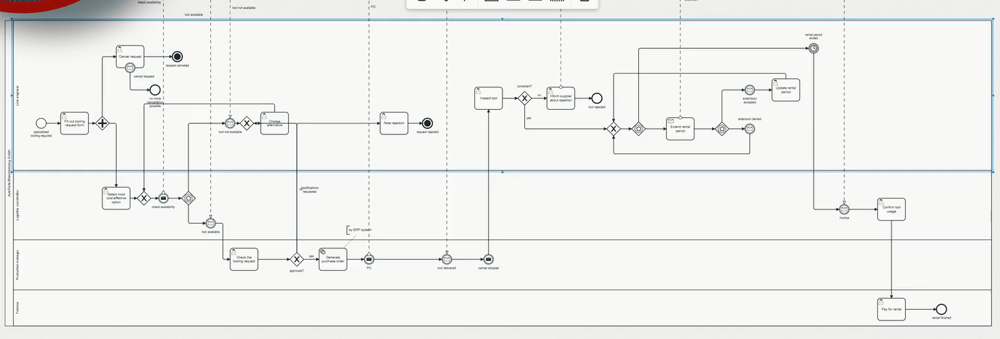

# Week 7: E-Portfolio 2: Business Process Modelling

# Artefact 1: BPMN Business Process Modeling for Beginners – Tool Rental (video)

Watch on YouTube: https://youtu.be/HEdoyk4GKho ·  [Companion BPMN files on GitHub](https://github.com/ahense/bpmn)

**Summary:**

Hense (2025) builds a BPMN 2.0 model of a tool rental process live in Camunda Modeler. He adds elements one at a time and explains why each gateway, event and lane is needed (Hense 2025, 04:06). The finished model has one company pool with four role lanes, a collapsed Supplier pool, and event-based gateways with message and timer events so the process waits for replies (Hense 2025, 39:50).

**Why I chose it:**

I selected this because Week 4 lectures introduced BPMN 2.0 as the notation that supports design, analysis and execution (ABPMP International 2019, p. 98). The lecture showed the symbols. This video shows how a modeller decides what to leave out. Hense never models the supplier's own steps; he collapses that pool and shows only the messages that cross it (Hense 2025, 39:50). Before this I would have drawn the supplier's process too. Now I understand the Week 5 point that a process is modelled only to the level its purpose needs, and that other organisations' processes sit at a higher level (ABPMP International 2019, p. 113).

*Figure 1: The finished tool rental model in Camunda Modeler. Source: Hense (2025, 39:50)*

---

## Artefact 2: *Practical Business Process Modeling and Analysis* – Chapter 1 (book)

 [Chapter 1 free preview on Packt](https://www.packtpub.com/en-au/product/practical-business-process-modeling-and-analysis-9781805126744)

**Summary:**

Sinur, Misiak and Biernatowski (2025) argue in Chapter 1 that modelling and analysing processes is now a basic skill, not a specialist one. Digital and AI transformation programs fail when they automate processes nobody has understood (Sinur, Misiak & Biernatowski 2025). The chapter positions BPMN as the link between strategy and execution (Sinur, Misiak & Biernatowski 2025)

**Why I chose it:**

This chapter matters because it explains the "why" behind the Week 4 purpose of modelling, which is to represent a process accurately and sufficiently for the task at hand (ABPMP International 2019, p. 94). The authors warn that organisations lead with technology instead of process. This matches the Week 7 lecture point that technology-first change fails because it does not start from the customer or the process (ABPMP International 2019, p. 203). Reading both together showed me that modelling is a strategic activity, not just documentation. The book is practitioner opinion rather than research, but it gives a current view that CBOK does not.

---
